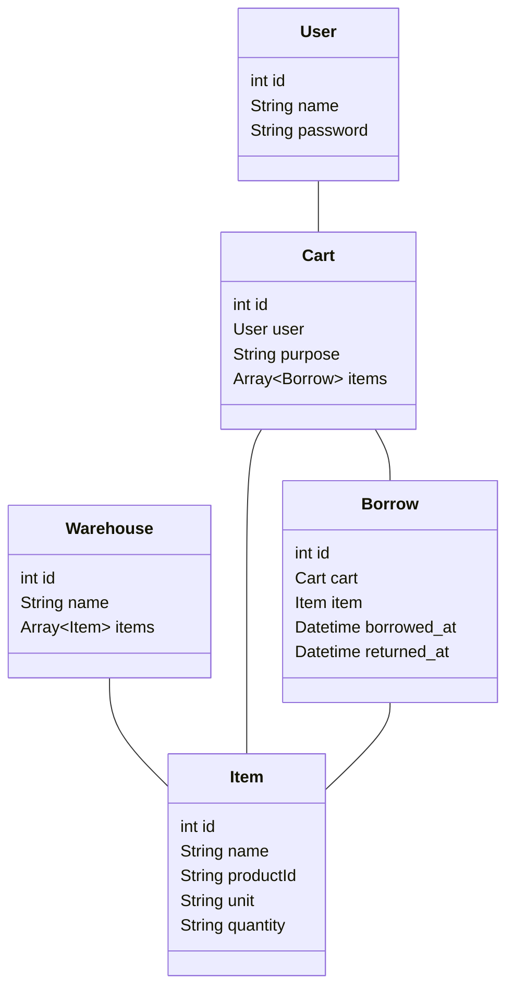

# Manage Warehouse Items(倉庫内物品管理システム)

倉庫からの物品の‘持ち出し‘、`返却`、`消費(破棄)`を管理する。

`持ち出し`されている物品も含めた倉庫の状態を管理することを目的とする。

物品は`QRコード`で管理され、`持ち出し`、`返却`もその`QRコード`を使用する。

## Usage
[DEMO](#)

## Development
Use this command when running locally.
```shell
TBD
```

### Models

| name      | description                   |
|-----------|-------------------------------|
| User      | 持ち出し、返却を行う人                   |
| Warehouse | 倉庫、物品が置かれている場所                |
| Item      | 物品                            |
| Cart      | 目的(現場、案件)ごとの持ち出し`Item`をまとめるもの |
| Borrow    | 持ち出された`Item`                  |



## Built With
- wip

## License
MIT
